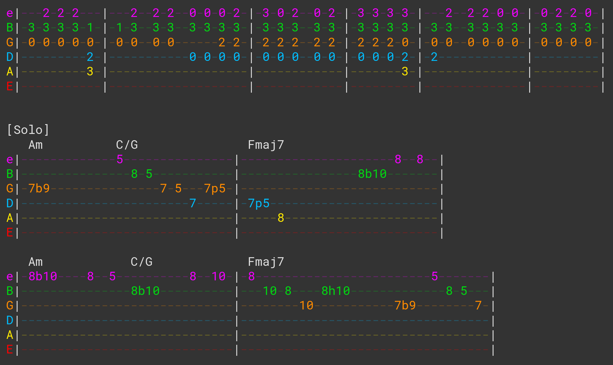

# Greasemonkey Ultimate Guitar Rocksmith Highlighter

This is a [GreaseMonkey](https://addons.mozilla.org/en-US/firefox/addon/greasemonkey/) / [TamperMonkey](https://chrome.google.com/webstore/detail/tampermonkey/dhdgffkkebhmkfjojejmpbldmpobfkfo) user script that applies colors to a [Ultimate Guitar](http://www.ultimate-guitar.com) tab in order to match [Rocksmith](https://en.wikipedia.org/wiki/Rocksmith_2014)'s color scheme.

It matches tabs when they're "well-formed", but it's flexible enough that it works on tabs that are more "creatively" formatted. Some extreme cases are not supported, but at some point you have to draw the line on what "special" format variations you'll support.

Untested on TamperMonkey, but I understand that the user scripts should be mutually compatible.

